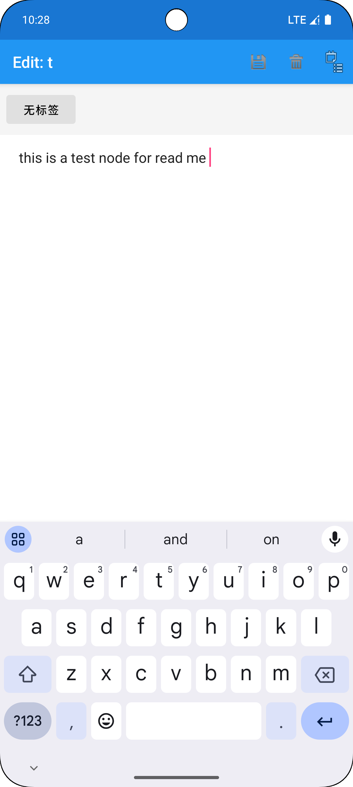
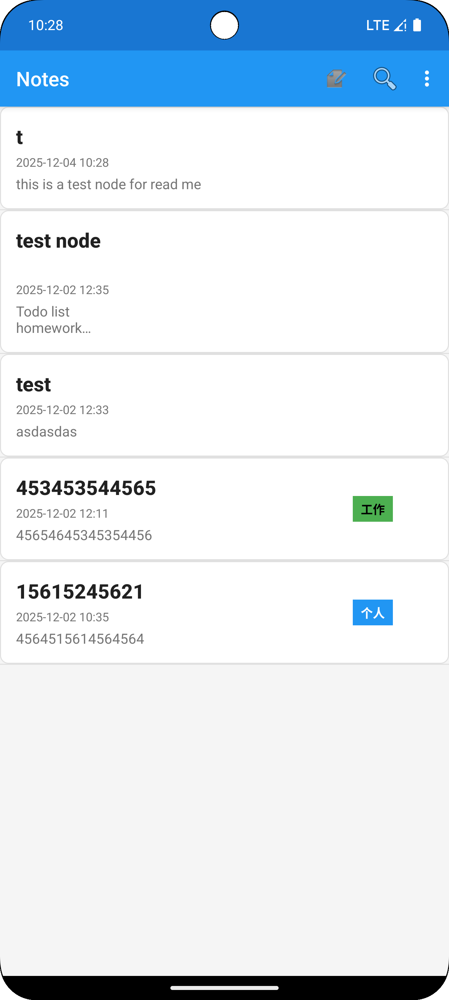
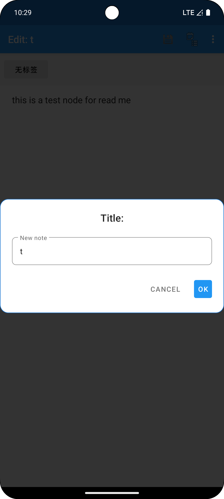
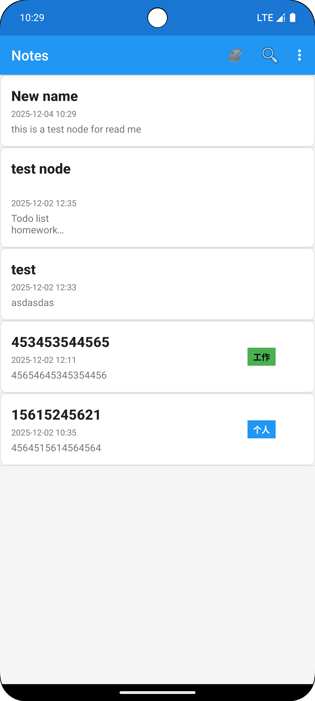
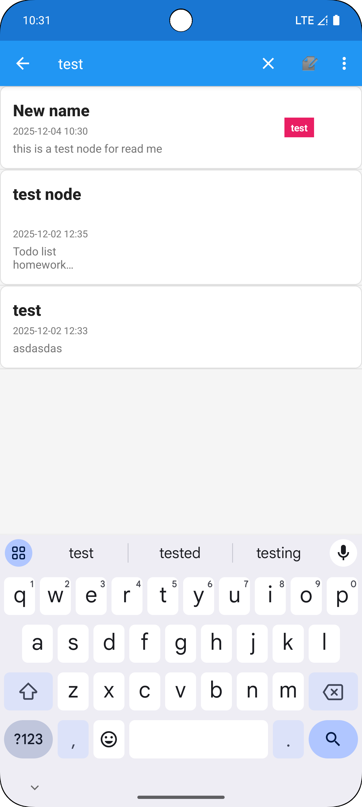
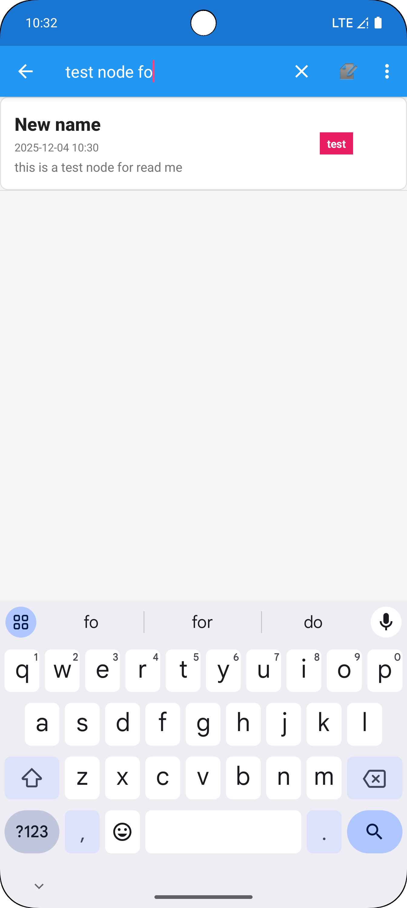
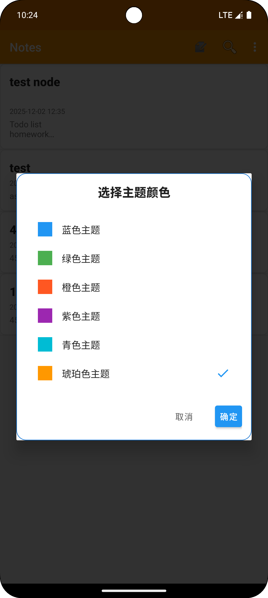
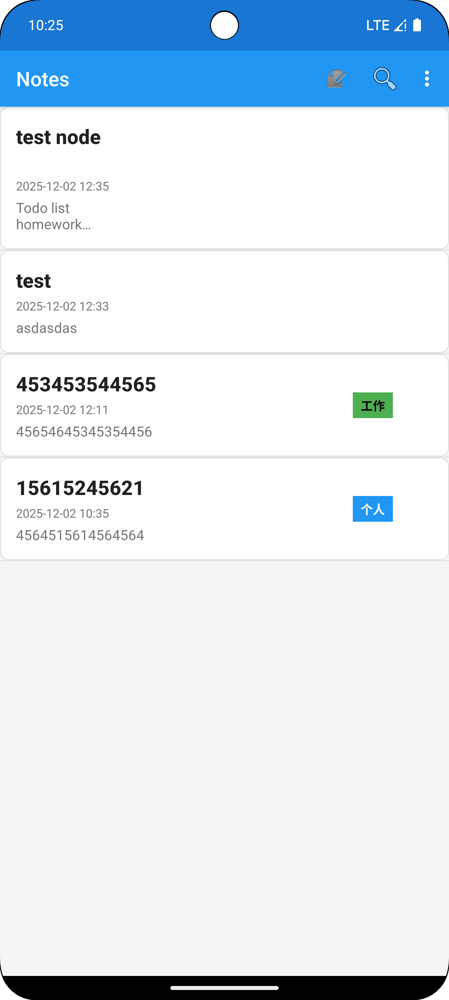
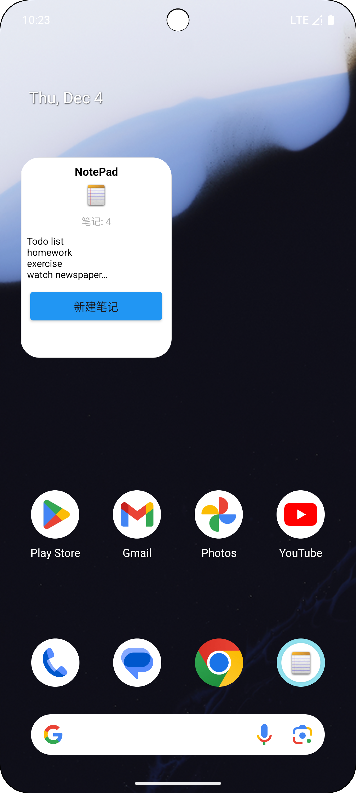

# NotePad应用介绍
## 基础功能
### 时间戳功能
    应用增加了一个时间戳功能，保存并显示用户最后更新编辑备忘录时间，在主界面显示备忘录时按时间戳降序排序
（1）数据库设计部分主要修改了NotePadProvider.java类，在在 notes 表中设计了 modified 列（COLUMN_NAME_MODIFICATION_DATE）

```java
        sNotesProjectionMap.put(
                NotePad.Notes.COLUMN_NAME_MODIFICATION_DATE,
                NotePad.Notes.COLUMN_NAME_MODIFICATION_DATE);

        @Override
        public void onCreate(SQLiteDatabase db) {
            db.execSQL("CREATE TABLE " + NotePad.Notes.TABLE_NAME + " ("
                    + NotePad.Notes._ID + " INTEGER PRIMARY KEY,"
                    + NotePad.Notes.COLUMN_NAME_TITLE + " TEXT,"
                    + NotePad.Notes.COLUMN_NAME_NOTE + " TEXT,"
                    + NotePad.Notes.COLUMN_NAME_MODIFICATION_DATE + " INTEGER," // ← 时间戳列
                    + NotePad.Notes.COLUMN_NAME_TAG_ID + " INTEGER DEFAULT 0"
                    + ");");
```
另外，在NotePadProdiver.java类中定义insert方法，此方法实现了在创建笔记时自动时自动设置时间戳
```java
@Override
public Uri insert(Uri uri, ContentValues initialValues) {
    // 获取当前系统时间
    Long now = Long.valueOf(System.currentTimeMillis());
    
    // 如果未提供修改日期，自动设置
    if (values.containsKey(NotePad.Notes.COLUMN_NAME_MODIFICATION_DATE) == false) {
        values.put(NotePad.Notes.COLUMN_NAME_MODIFICATION_DATE, now);
    }
    
    // ... 执行插入操作
}
```
(2)在NoteEditor.java中updateNote用于实现当用户更新备忘录时同步更新时间戳，实现备忘录编辑自动更新时间戳
```java
private final void updateNote(String text, String title) {
    ContentValues values = new ContentValues();
    
    // 只要有内容/标题/标签变化，就更新时间戳
    if (contentChanged || titleChanged || mState == STATE_INSERT 
            || mTagId != getCurrentTagIdFromCursor()) {
        values.put(NotePad.Notes.COLUMN_NAME_MODIFICATION_DATE, 
                  System.currentTimeMillis());  // ← 更新时间戳
    }
    
    // ... 其他字段更新
}
```
(3)在NotesList.java类中格式化时间戳显示并绑定R.id.tv_time组件，用于实现主界面的时间戳显示
```java
// 格式化时间戳为易读字符串
private String formatTimestamp(long timestamp) {
    SimpleDateFormat sdf = new SimpleDateFormat(
        "yyyy-MM-dd HH:mm", Locale.getDefault()
    );
    return sdf.format(new Date(timestamp));
}

// 在列表适配器中绑定显示
mAdapter.setViewBinder(new SimpleCursorAdapter.ViewBinder() {
    @Override
    public boolean setViewValue(View view, Cursor cursor, int columnIndex) {
        if (view.getId() == R.id.tv_time) {
            long modificationDate = cursor.getLong(COLUMN_INDEX_MODIFICATION_DATE);
            String timeText = formatTimestamp(modificationDate);
            TextView timeView = (TextView) view;
            timeView.setText(timeText);
            return true;
        }
        return false;
    }
});
```
（4）在NotePad.java中定义默认排序规则，这样就会在编辑成功、查询时备忘录按照时间排序
```java
// 默认按修改时间降序排列（最新的在前面）
public static final String DEFAULT_SORT_ORDER = "modified DESC";
```
下面四张图片展示了创建备忘录之后的时间戳，以及修改标题之后的时间戳变化
<div align="center">
  
  
</div>
<div align="center">
  
  
</div>

### 查询功能
    查询支持对标题和内容的模糊查询，并且可以与标签筛选结合使用。

(1)NotesList.java中onCreateOptionsMenu方法中，初始化了SearchView，为SearchView设置了两个监听器：onQueryTextSubmit：当用户提交查询（比如按回车）时，立即执行搜索；onQueryTextChange：当查询文本发生变化时，我们延迟500毫秒执行搜索，以避免频繁查询数据库。
```java
// 初始化搜索功能
MenuItem searchItem = menu.findItem(R.id.menu_search);
if (searchItem != null) {
    SearchView searchView = (SearchView) searchItem.getActionView();
    if (searchView != null) {
        searchView.setQueryHint(getString(R.string.search_hint));
        
        searchView.setOnQueryTextListener(new SearchView.OnQueryTextListener() {
            @Override
            public boolean onQueryTextSubmit(String query) {
                performSearch(query);  
                searchView.clearFocus();
                return true;
            }
            
            @Override
            public boolean onQueryTextChange(String newText) {
                if (searchHandler != null) {
                    searchHandler.removeCallbacks(searchRunnable);
                }
                searchRunnable = () -> performSearch(newText);
                searchHandler.postDelayed(searchRunnable, 500); // 延迟500ms执行
                return true;
            }
        });
        
        searchView.setOnCloseListener(new SearchView.OnCloseListener() {
            @Override
            public boolean onClose() {
                refreshNoteList(); // 关闭搜索时刷新列表
                return false;
            }
        });
    }
}
```
（2）搜索的实际执行在NotesList.java中的performSearch方法中,在这个方法中，我们根据当前是否选择了标签筛选条件来构建不同的查询条件(后面会提到）。
如果当前有标签筛选（mCurrentFilterTagId != -1），则查询条件中会加上标签ID的条件；否则，只根据标题和内容进行模糊查询。我们通过ContentResolver查询数据库，并更新适配器的游标，从而更新列表显示。另外，当搜索框关闭时，我们调用refreshNoteList()来刷新列表，显示所有笔记（或当前标签筛选下的所有笔记）。具体的处理数据库查询请求的query方法在NotePadProvider.java定义了。
```java
private void performSearch(String query) {
    if (query == null || query.trim().isEmpty()) {
        refreshNoteList();
        return;
    }
    
    String selection;
    String[] selectionArgs;
    
    // 结合标签筛选条件
    if (mCurrentFilterTagId != -1) {
        selection = "(" + NotePad.Notes.COLUMN_NAME_TITLE + " LIKE ? OR " +
                    NotePad.Notes.COLUMN_NAME_NOTE + " LIKE ?) AND " +
                    NotePad.Notes.COLUMN_NAME_TAG_ID + " = ?";
        selectionArgs = new String[]{"%" + query + "%", "%" + query + "%", 
                    String.valueOf(mCurrentFilterTagId)};
    } else {
        // 基础搜索：在标题或内容中搜索
        selection = NotePad.Notes.COLUMN_NAME_TITLE + " LIKE ? OR " +
                    NotePad.Notes.COLUMN_NAME_NOTE + " LIKE ?";
        selectionArgs = new String[]{"%" + query + "%", "%" + query + "%"};
    }
    
    // 执行查询
    Cursor cursor = getContentResolver().query(
            getIntent().getData(),
            PROJECTION,
            selection,
            selectionArgs,
            NotePad.Notes.DEFAULT_SORT_ORDER
    );
    
    mAdapter.changeCursor(cursor); // 更新列表适配器
    
    if (cursor != null && cursor.getCount() == 0) {
        Toast.makeText(this, R.string.no_search_results, Toast.LENGTH_SHORT).show();
    }
}
```
刷新笔记列表
```java
private void refreshNoteList() {
    String selection = null;
    String[] selectionArgs = null;
    
    // 考虑标签筛选条件
    if (mCurrentFilterTagId != -1) {
        selection = NotePad.Notes.COLUMN_NAME_TAG_ID + " = ?";
        selectionArgs = new String[]{String.valueOf(mCurrentFilterTagId)};
    }
    
    // 查询数据库
    Cursor cursor = getContentResolver().query(
            getIntent().getData(),
            PROJECTION,
            selection,
            selectionArgs,
            NotePad.Notes.DEFAULT_SORT_ORDER
    );
    
    mAdapter.changeCursor(cursor); // 更新适配器
}
```
下图是标题和文本搜索功能预览



## 扩展功能

### 界面美化
    支持动态切换多套配色方案，提升用户体验。
（1）ThemeManager.java类负责管理主题相关的操作，包括获取当前主题、设置主题、获取主题颜色等。
```java
// 主题颜色数组定义（主色，深色，强调色）
private static final int[][] THEME_COLORS = {
    {0xFF2196F3, 0xFF1976D2, 0xFFFF4081}, // 蓝色主题
    {0xFF4CAF50, 0xFF388E3C, 0xFF8BC34A}, // 绿色主题
    {0xFFFF5722, 0xFFD84315, 0xFFFF9800}, // 橙色主题
    // ... 更多主题
};

// 应用主题到Activity
public static void applyTheme(AppCompatActivity activity) {
    int themeIndex = getCurrentThemeIndex(activity);
    int colorPrimary = THEME_COLORS[themeIndex][0];
    int colorPrimaryDark = THEME_COLORS[themeIndex][1];
    int colorAccent = THEME_COLORS[themeIndex][2];
    
    // 设置状态栏颜色
    if (Build.VERSION.SDK_INT >= Build.VERSION_CODES.LOLLIPOP) {
        Window window = activity.getWindow();
        window.addFlags(WindowManager.LayoutParams.FLAG_DRAWS_SYSTEM_BAR_BACKGROUNDS);
        window.setStatusBarColor(colorPrimaryDark);
    }
    
    // 设置ActionBar/Toolbar颜色
    if (activity.getSupportActionBar() != null) {
        activity.getSupportActionBar().setBackgroundDrawable(
            new ColorDrawable(colorPrimary));
    }
}
```
（2）ThemeSelectionDialog.java类是一个DialogFragment，用于让用户选择主题，ThemeAdapter.java是一个RecyclerView.Adapter，用于在对话框中显示主题列表。
ThemeSelectionDialog.java主题选择对话框
```java
public class ThemeSelectionDialog extends DialogFragment {
    private ThemeAdapter adapter;
    private OnThemeChangeListener listener;
    
    @NonNull
    @Override
    public Dialog onCreateDialog(Bundle savedInstanceState) {
        // 获取当前主题索引
        selectedIndex = ThemeManager.getCurrentThemeIndex(context);
        
        // 设置RecyclerView显示主题列表
        RecyclerView recyclerView = view.findViewById(R.id.rv_themes);
        recyclerView.setLayoutManager(new LinearLayoutManager(context));
        
        adapter = new ThemeAdapter(context, selectedIndex);
        adapter.setOnThemeSelectedListener(position -> {
            selectedIndex = position;
            adapter.setSelectedIndex(position);
        });
        
        // 确定按钮点击事件
        btnOk.setOnClickListener(v -> {
            ThemeManager.setThemeIndex(context, selectedIndex);
            if (listener != null) {
                listener.onThemeChanged(selectedIndex);
            }
            dismiss();
        });
    }
}
```
(3)NotesList.java中应用主列表界面的主题
```java
@Override
protected void onCreate(Bundle savedInstanceState) {
    // 首先应用主题，然后调用父类的onCreate
    applyTheme();
    super.onCreate(savedInstanceState);
    
    // ... 其他初始化代码
}

private void applyTheme() {
    ThemeManager.applyTheme(this);
}

private void showThemeSelectionDialog() {
    themeDialog = new ThemeSelectionDialog();
    themeDialog.setOnThemeChangeListener(themeIndex -> {
        // 重启Activity以应用新主题
        recreate();
    });
    themeDialog.show(getSupportFragmentManager(), "theme_dialog");
}
```
(4)NoteEditor.java中编辑器应用主题界面
```java
@Override
protected void onCreate(Bundle savedInstanceState) {
    ThemeManager.applyTheme(this);  // 应用主题
    super.onCreate(savedInstanceState);
    setContentView(R.layout.note_editor);
    
    // ... 其他初始化代码
}

// 带行号的EditText，根据主题颜色绘制线条
public static class LinedEditText extends AppCompatEditText {
    @Override
    protected void onDraw(Canvas canvas) {
        // 更新线条颜色，确保使用当前主题
        mPaint.setColor(ThemeManager.getThemeColor(mContext, 0));
        
        // 绘制线条逻辑
        for (int i = 0; i < count; i++) {
            canvas.drawLine(r.left, baseline + 4, r.right, baseline + 4, paint);
        }
        super.onDraw(canvas);
    }
    
    public void updateLineColor() {
        mPaint.setColor(ThemeManager.getThemeColor(mContext, 0));
        invalidate();
    }
}
```




### 标签功能

```java

```

```java

```

```java

```

### 小组件功能
    应用提供了一个桌面小组件，可以显示笔记的总数和最新笔记的内容。点击小组件可以快速打开应用主界面或创建新笔记。
（1）NotePadAppWidget.java类说小组件的提供者，继承自AppWidgetProvider，负责更新小组件的界面和响应小组件的更新请求。
在onUpdate方法中遍历所有需要更新的小组件ID，对每一个调用updateAppWidget方法。
```java
@Override
    public void onUpdate(Context context, AppWidgetManager appWidgetManager, int[] appWidgetIds) {
        for (int appWidgetId : appWidgetIds) {
            updateAppWidget(context, appWidgetManager, appWidgetId);
        }
    }
```
在updateAppWidget方法中创建RemoteViews对象，关联布局文件widget_note_pad；调用getNoteCount和getLatestNoteContent方法获取笔记数量和最新笔记内容并将获取的数据设置到RemoteViews中的TextView中；设置点击事件，点击图标和标题打开主界面，点击新建按钮打开新建笔记界面；最后调用appWidgetManager.updateAppWidget更新小组件
```java
static void updateAppWidget(Context context, AppWidgetManager appWidgetManager, int appWidgetId) {
        RemoteViews views = new RemoteViews(context.getPackageName(), R.layout.widget_note_pad);

        // 1. 获取笔记统计数据
        int noteCount = getNoteCount(context);
        // 2. 获取最新的笔记内容
        String latestNoteContent = getLatestNoteContent(context); // 使用新方法

        // 3. 更新Widget显示
        views.setTextViewText(R.id.widget_note_count, "笔记: " + noteCount);
        // 将内容设置到新的TextView上，例如 R.id.widget_note_content
        views.setTextViewText(R.id.widget_note_content, latestNoteContent);

        // 设置点击事件：打开应用主界面
        Intent mainIntent = new Intent(context, NotesList.class);
        mainIntent.setAction(Intent.ACTION_MAIN);
        PendingIntent mainPendingIntent = PendingIntent.getActivity(
                context, 0, mainIntent, PendingIntent.FLAG_UPDATE_CURRENT | PendingIntent.FLAG_IMMUTABLE);
        views.setOnClickPendingIntent(R.id.widget_icon, mainPendingIntent);

        // 设置点击事件：打开新建笔记
        Intent newNoteIntent = new Intent(context, NoteEditor.class);
        newNoteIntent.setAction(Intent.ACTION_INSERT);
        newNoteIntent.setData(NotePad.Notes.CONTENT_URI);
        PendingIntent newNotePendingIntent = PendingIntent.getActivity(
                context, 1, newNoteIntent, PendingIntent.FLAG_UPDATE_CURRENT | PendingIntent.FLAG_IMMUTABLE);
        views.setOnClickPendingIntent(R.id.widget_new_note_btn, newNotePendingIntent);

        // 设置点击Widget整体打开应用
        views.setOnClickPendingIntent(R.id.widget_title, mainPendingIntent);

        // 告诉AppWidgetManager对当前Widget执行更新
        appWidgetManager.updateAppWidget(appWidgetId, views);
    }
```
（2）NotePadProvider.java负责在数据变化的时候触发小组件更新。
例如在insert方法中：
```java
if (rowId > 0) {
Uri noteUri = ContentUris.withAppendedId(NotePad.Notes.CONTENT_ID_URI_BASE, rowId);
getContext().getContentResolver().notifyChange(noteUri, null);
        // 更新Widget
        NotePadAppWidget.updateAllWidgets(getContext());
        return noteUri;
    }
```
在update方法中也有：
```java
getContext().getContentResolver().notifyChange(uri, null);
    // 更新Widget
    NotePadAppWidget.updateAllWidgets(getContext());
```
(3)NotePadWidgetConfigureActivity.java负责配置活动，主要作用是为小组件设置一些初始配置，并保存这些配置。
```java
@Override
    public void onCreate(Bundle icicle) {
        super.onCreate(icicle);

        // 设置结果默认为取消
        setResult(RESULT_CANCELED);

        setContentView(R.layout.widget_configure);

        // 找到保存按钮
        findViewById(R.id.save_button).setOnClickListener(new View.OnClickListener() {
            public void onClick(View v) {
                final Context context = NotePadWidgetConfigureActivity.this;

                // 保存配置
                saveWidgetPref(context, mAppWidgetId, "default");

                // 更新Widget
                AppWidgetManager appWidgetManager = AppWidgetManager.getInstance(context);
                NotePadAppWidget.updateAppWidget(context, appWidgetManager, mAppWidgetId);

                // 设置结果并关闭
                Intent resultValue = new Intent();
                resultValue.putExtra(AppWidgetManager.EXTRA_APPWIDGET_ID, mAppWidgetId);
                setResult(RESULT_OK, resultValue);
                finish();
            }
        });

        // 找到取消按钮
        findViewById(R.id.cancel_button).setOnClickListener(new View.OnClickListener() {
            public void onClick(View v) {
                finish();
            }
        });

        // 获取Widget ID
        Intent intent = getIntent();
        Bundle extras = intent.getExtras();
        if (extras != null) {
            mAppWidgetId = extras.getInt(
                    AppWidgetManager.EXTRA_APPWIDGET_ID,
                    AppWidgetManager.INVALID_APPWIDGET_ID);
        }

        // 如果没有有效的Widget ID，直接退出
        if (mAppWidgetId == AppWidgetManager.INVALID_APPWIDGET_ID) {
            finish();
            return;
        }
    }
```

